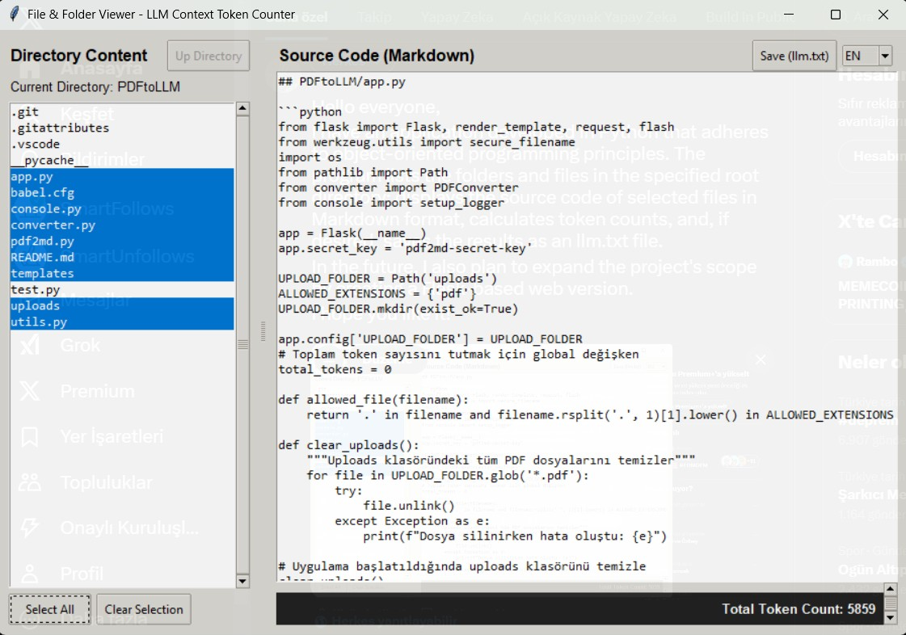

# CodeContextor



A specialized tool for preparing and sending source code to LLM chats. CodeContextor helps you scan project directories, calculate token usage, and format entire codebases for AI analysis and modifications.

## Features

- 🔍 Scan and collect entire project source code
- 📊 Real-time token counting for different LLM models
- 📁 Smart directory traversal and file filtering
- ⚡ Quick copy-paste to LLM chat interfaces
- 🌐 Multi-language support (English, Turkish, Russian)
- 💡 Intelligent context preparation for code modifications

## Technical Stack

- Python 3.x with type hints
- Modern Python practices (pathlib, dataclasses)
- Tkinter for GUI
- Source code parsing and formatting
- Token estimation for popular LLM models

## Installation

```bash
git clone https://github.com/yourusername/CodeContextor.git
cd CodeContextor
pip install -r requirements.txt
```

## Usage

```bash
python main.py
```

## Contributing

Contributions are welcome! Please feel free to submit a Pull Request.

## License

MIT License - See LICENSE file for details
